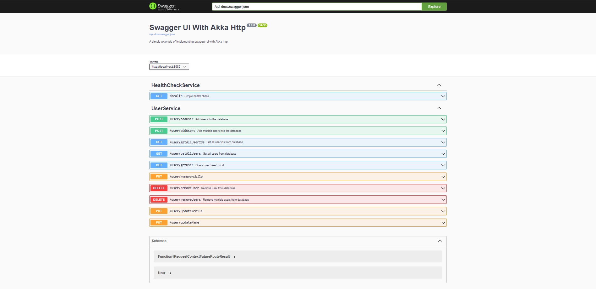

# Swagger UI With Akka Http Sample

## Configuration

| **Lib** | Version |
|--|--|
| **Scala** | 2.13.8 |
| **Swagger UI** | 4.14.0 |
| **Akka** | 2.6.20 |
| **Akka Http** | 10.2.10 |

## How to run?

    sbt run

Launch your browser and navigate to **localhost:8080**.

## Example

